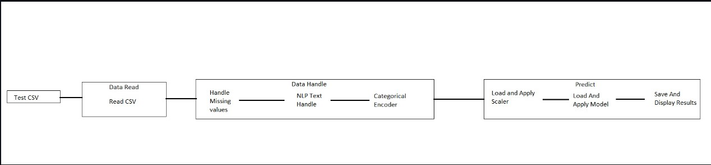

# Fake-Job-Posting-Prediction-using-ML

This is a classifier that uses NLP to determine if a job posting is real or fake. Dataset is collected from kaggle

 There are 18 columns like title, department, company profile, job description etc. I will use NLP Techniques to analyse text data and prepare them for prediction model to train. Also this complete project uses pipeline concept automating the train and test process. Once the training is complete the model will be saved as a pickle file to load whenever we need to predict.

There are 17880 samples in the dataset in which 17014 are real job data and 866 are fake job data. The data is biased towards real job data so the main parameters used to rate prediction is not just accuracy but F1-score, Precision and recall as well. Before starting the whole coding process I have split the data into two datasets Train with 97% split and Test with 3% split. For the model I have used Random Forest Classifier which at the end has achieved F1-score 0.97  with accuracy around 97%.

Pipeline Overview
 This is a overall view of the files and functionalities used in both the pipelines in the project. 

 

Training Pipeline
 

 The training process contains 3 major steps

Data Reading
Data Handling
Model
First we read the data using Data Read file and then pass it to Data handling file where the missing values, Text data Handling takes place and finally categorical encoding is done for category columns. After Handling the data and scaling then we will utilize Random Forest algorithm to create and train model on the cleaned data.
 

 

Testing Pipeline
 Similar to training we need to read the data using Data Read file and then handle the data(missing values, Text data Handling, categorical encoding). After Handling the data and scaling them we will make use of the saved model to test the data and save the predicted result as a csv. Here for testing process we use the saved categorical encoder and saved scaler instead of newly creating. Also in the end it will display the metrics used for rating.
  

NLP Text Handling
For columns like title, department, company profile, job description etc for all the categorical I have used NLTK functions like stop words, Stemming and Word net synset to find out a similarity factor between columns eg: similarity between job title and job description. Using various combinations I have formed various new columns which represent such kind of similarities. Now all these columns are used in the Random Forest algorithm to find the Fake jobs. With all these steps I have reached precision of 97% and f1-score of 0.97
